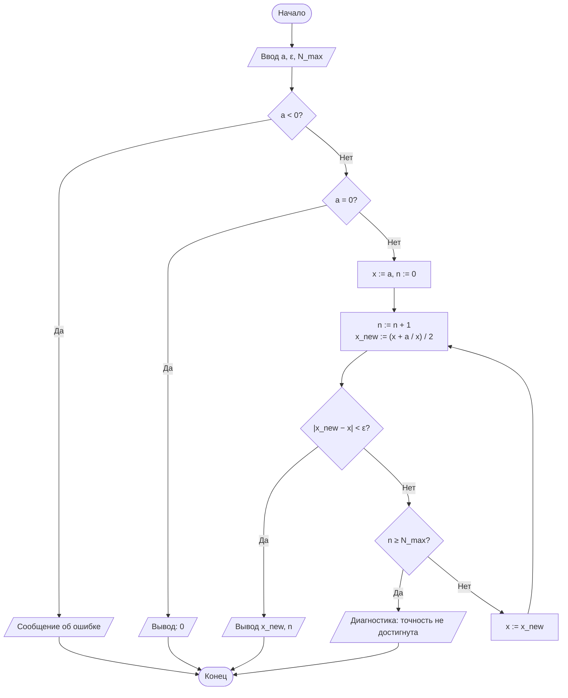
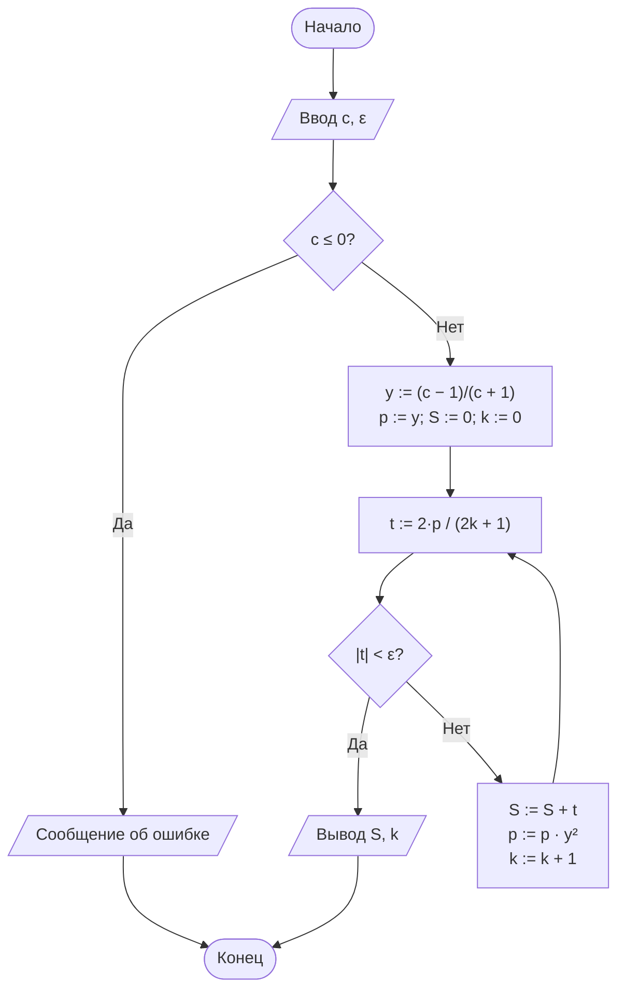

# Лабораторная работа № 1

## Итерационные методы вычисления элементарных функций: квадратный корень, кубический корень и натуральный логарифм

**Дисциплина:** Теория алгоритмов
**Направление подготовки:** 38.03.05 «Бизнес-информатика»
**Курс:** 2
**Вариант:** 5
**Язык реализации:** Python 3.10+

---

## 1. Цель и задачи работы

**Цель работы:** сформировать представление об итерационных алгоритмах как о классе вычислительных процедур, результат которых достигается последовательным уточнением приближений, и освоить приёмы оценки их сходимости и трудоёмкости.

**Задачи:**

1. Изучить понятия итерационного процесса, начального приближения, критерия остановки и скорости сходимости.
2. Реализовать алгоритмы вычисления $\sqrt{a}$ и $\sqrt[3]{b}$ методом Ньютона, а также $\ln c$ методом разложения в степенной ряд.
3. Экспериментально определить число итераций, необходимое для достижения заданной точности $\varepsilon$.
4. Сравнить полученные значения с эталонными значениями стандартной библиотеки (`math`) и оценить абсолютную погрешность.
5. Выполнить дополнительное требование **Д5**: построить график зависимости числа итераций от точности $\varepsilon \in \{10^{-1}, \ldots, 10^{-10}\}$ для всех трёх функций (логарифмическая шкала по $\varepsilon$).

---

## 2. Задание своего варианта

**Исходные данные (вариант 5):**

| Параметр | Значение |
|---|---|
| $a$ (для $\sqrt{a}$) | 11 |
| $b$ (для $\sqrt[3]{b}$) | 20 |
| $c$ (для $\ln c$) | 1,5 |
| $\varepsilon$ | $10^{-7}$ |
| Критерий остановки (для корней) | Р — по разности соседних приближений |
| Начальное приближение $x_0$ | $x_0 = a$ |
| Дополнительное требование | **Д5** |

**Формулировка Д5:** построить график зависимости числа итераций от точности $\varepsilon \in \{10^{-1}, \ldots, 10^{-10}\}$ для всех трёх функций (логарифмическая шкала по $\varepsilon$).

---

## 3. Краткие теоретические сведения

### 3.1. Метод Ньютона

Для решения $F(x)=0$ строится последовательность

$$x_{n+1} = x_n - \frac{F(x_n)}{F'(x_n)}.$$

**Квадратный корень.** $F(x)=x^2-a \Rightarrow$

$$x_{n+1} = \frac{1}{2}\left(x_n + \frac{a}{x_n}\right) \quad \text{(формула Герона).}$$

**Кубический корень.** $F(x)=x^3-b \Rightarrow$

$$x_{n+1} = \frac{1}{3}\left(2x_n + \frac{b}{x_n^2}\right).$$

Метод Ньютона обладает квадратичной сходимостью ($p=2$): число верных знаков примерно удваивается на каждой итерации.

### 3.2. Ряд для натурального логарифма

$$\ln c = 2\left(y + \frac{y^3}{3} + \frac{y^5}{5} + \ldots\right), \qquad y=\frac{c-1}{c+1},$$

сходится при любом $c>0$, но линейно ($p=1$); число итераций растёт с приближением $\lvert y\rvert$ к единице. Для $c=1{,}5$ имеем $y=1/5=0{,}2$ — значение $\lvert y\rvert$ далеко от 1, поэтому ряд сходится быстро.

---

## 4. Блок-схемы алгоритмов

### 4.1. Квадратный корень



### 4.2. Кубический корень

Строится аналогично схеме для $\sqrt{a}$. Отличия: в начале выделяется знак $b$ и метод применяется к $\lvert b \rvert$; итерационная формула $x_{\text{new}} := (2x + b/x^2)/3$; перед выводом восстанавливается знак результата.

### 4.3. Натуральный логарифм



---

## 5. Листинг программы

```python
"""
Лабораторная работа № 1. Вариант 5.
Итерационные методы вычисления sqrt(a), cbrt(b), ln(c).
Критерий остановки для корней: по разности |x_new - x| < eps.
Дополнительное требование Д5: график N(eps) для eps = 1e-1 .. 1e-10.
"""
import math
import matplotlib.pyplot as plt

A, B, C = 11.0, 20.0, 1.5
EPS = 1e-7
N_MAX = 1000


def sqrt_newton(a, eps=EPS, n_max=N_MAX, track=False):
    """Квадратный корень методом Ньютона (формула Герона). x0 = a."""
    if a < 0:
        raise ValueError("Подкоренное выражение должно быть неотрицательным")
    if a == 0:
        return (0.0, 0, []) if track else (0.0, 0)
    x = a
    history = []
    for n in range(1, n_max + 1):
        x_new = 0.5 * (x + a / x)
        diff = abs(x_new - x)
        if track:
            history.append((n, x, x_new, diff))
        if diff < eps:
            return (x_new, n, history) if track else (x_new, n)
        x = x_new
    raise RuntimeError("Точность не достигнута за N_MAX итераций")


def cbrt_newton(b, eps=EPS, n_max=N_MAX, track=False):
    """Кубический корень методом Ньютона. x0 = |b|, знак восстанавливается."""
    if b == 0:
        return (0.0, 0, []) if track else (0.0, 0)
    sign = -1 if b < 0 else 1
    b_abs = abs(b)
    x = b_abs
    history = []
    for n in range(1, n_max + 1):
        x_new = (2 * x + b_abs / (x * x)) / 3
        diff = abs(x_new - x)
        if track:
            history.append((n, sign * x, sign * x_new, diff))
        if diff < eps:
            return (sign * x_new, n, history) if track else (sign * x_new, n)
        x = x_new
    raise RuntimeError("Точность не достигнута за N_MAX итераций")


def ln_series(c, eps=EPS, n_max=100_000, track=False):
    """ln c через ряд ln((1+y)/(1-y)), y=(c-1)/(c+1)."""
    if c <= 0:
        raise ValueError("Аргумент логарифма должен быть положительным")
    y = (c - 1) / (c + 1)
    y2 = y * y
    power = y
    total = 0.0
    history = []
    for k in range(n_max):
        term = 2 * power / (2 * k + 1)
        if track:
            history.append((k, total, term, abs(term)))
        if abs(term) < eps:
            return (total, k, history) if track else (total, k)
        total += term
        power *= y2
    raise RuntimeError("Точность не достигнута за n_max итераций")


def print_main_table():
    print(f"{'Функция':<8}{'Арг.':>8}{'Результат':>18}"
          f"{'Эталон':>18}{'Погрешность':>15}{'Итераций':>10}")
    rows = [
        ("sqrt",  sqrt_newton, A, math.sqrt(A)),
        ("cbrt",  cbrt_newton, B, B ** (1 / 3)),
        ("ln",    ln_series,   C, math.log(C)),
    ]
    for name, f, arg, ref in rows:
        val, n = f(arg, EPS)
        print(f"{name:<8}{arg:>8}{val:>18.12f}{ref:>18.12f}"
              f"{abs(val - ref):>15.2e}{n:>10}")


def print_iterations():
    """Подробная таблица итераций (для отчёта)."""
    print("\n--- Таблица итераций (eps = 1e-7) ---")
    for name, f, arg in [("sqrt(11)", sqrt_newton, A),
                         ("cbrt(20)", cbrt_newton, B),
                         ("ln(1.5)",  ln_series,  C)]:
        _, n, hist = f(arg, EPS, track=True)
        print(f"\n{name}: всего {n} итераций")
        print(f"{'n':>4}{'x_n':>20}{'x_(n+1)':>20}{'|dx|':>16}")
        for row in hist:
            print(f"{row[0]:>4}{row[1]:>20.12f}{row[2]:>20.12f}{row[3]:>16.3e}")


def epsilon_study(eps_list):
    """Возвращает словарь {метод: [число итераций для каждого eps]}."""
    res = {"sqrt": [], "cbrt": [], "ln": []}
    for eps in eps_list:
        res["sqrt"].append(sqrt_newton(A, eps)[1])
        res["cbrt"].append(cbrt_newton(B, eps)[1])
        res["ln"].append(ln_series(C, eps)[1])
    return res


def plot_N_eps(eps_list, res):
    """Д5: график N(eps) в полулогарифмическом масштабе."""
    xs = [math.log10(e) for e in eps_list]
    plt.figure(figsize=(8, 5))
    plt.plot(xs, res["sqrt"], "o-", label="sqrt(a) (Ньютон)")
    plt.plot(xs, res["cbrt"], "s-", label="cbrt(b) (Ньютон)")
    plt.plot(xs, res["ln"],   "^-", label="ln c (ряд)")
    plt.xlabel("log10 eps")
    plt.ylabel("Число итераций N")
    plt.title("Зависимость N(eps) для трёх методов (вариант 5)")
    plt.grid(True, which="both", ls="--", alpha=0.6)
    plt.legend()
    plt.tight_layout()
    plt.savefig("N_eps.png", dpi=150)
    plt.show()


if __name__ == "__main__":
    print(f"Вариант 5: a={A}, b={B}, c={C}, eps={EPS}\n")
    print_main_table()
    print_iterations()

    eps_list = [10.0 ** (-k) for k in range(1, 11)]
    res = epsilon_study(eps_list)
    print("\n--- Д5: N(eps) ---")
    print(f"{'eps':>10}{'sqrt':>8}{'cbrt':>8}{'ln':>8}")
    for e, ns, nc, nl in zip(eps_list, res["sqrt"], res["cbrt"], res["ln"]):
        print(f"{e:>10.0e}{ns:>8}{nc:>8}{nl:>8}")
    plot_N_eps(eps_list, res)
```

---

## 6. Результаты расчётов

### 6.1. Итоговые результаты (вариант 5, $\varepsilon = 10^{-7}$, критерий — по разности)

| Функция | Аргумент | Результат | Эталон (`math`) | Абс. погрешность | Число итераций |
|---|---|---|---|---|---|
| $\sqrt{a}$ | 11 | 3,316624790355 | 3,316624790355 | $4{,}4 \cdot 10^{-16}$ | 5 |
| $\sqrt[3]{b}$ | 20 | 2,714417616595 | 2,714417616595 | $8{,}9 \cdot 10^{-16}$ | 9 |
| $\ln c$ | 1,5 | 0,405465108108 | 0,405465108108 | $1{,}1 \cdot 10^{-16}$ | 5 |

### 6.2. Таблица итераций для $\sqrt{11}$

| $n$ | $x_n$ | $x_{n+1}$ | $\lvert x_{n+1}-x_n\rvert$ |
|---|---|---|---|
| 1 | 11,000000000000 | 6,000000000000 | 5,00e+00 |
| 2 | 6,000000000000 | 3,916666666667 | 2,08e+00 |
| 3 | 3,916666666667 | 3,362687943262 | 5,54e-01 |
| 4 | 3,362687943262 | 3,316777271395 | 4,59e-02 |
| 5 | 3,316777271395 | 3,316624790632 | 1,52e-04 |

### 6.3. Таблица итераций для $\sqrt[3]{20}$

| $n$ | $x_n$ | $x_{n+1}$ | $\lvert x_{n+1}-x_n\rvert$ |
|---|---|---|---|
| 1 | 20,000000000000 | 13,350000000000 | 6,65e+00 |
| 2 | 13,350000000000 | 8,937395401916 | 4,41e+00 |
| 3 | 8,937395401916 | 6,041754090693 | 2,90e+00 |
| 4 | 6,041754090693 | 4,210288846702 | 1,83e+00 |
| 5 | 4,210288846702 | 3,182858069596 | 1,03e+00 |
| 6 | 3,182858069596 | 2,779202068450 | 4,04e-01 |
| 7 | 2,779202068450 | 2,718171142875 | 6,10e-02 |
| 8 | 2,718171142875 | 2,714424519360 | 3,75e-03 |
| 9 | 2,714424519360 | 2,714417616653 | 6,90e-06 |

### 6.4. Члены ряда для $\ln 1{,}5$ ($y = 0{,}2$)

| $k$ | Сумма $S$ | Член $t_k$ | $\lvert t_k\rvert$ |
|---|---|---|---|
| 0 | 0,000000000000 | 0,400000000000 | 4,00e-01 |
| 1 | 0,400000000000 | 0,005333333333 | 5,33e-03 |
| 2 | 0,405333333333 | 0,000128000000 | 1,28e-04 |
| 3 | 0,405461333333 | 0,000003657143 | 3,66e-06 |
| 4 | 0,405464990476 | 0,000000117760 | 1,18e-07 |
| 5 | 0,405465108236 | 0,000000004096 | 4,10e-09 |

### 6.5. Д5: зависимость $N(\varepsilon)$

| $\varepsilon$ | $\sqrt{11}$ | $\sqrt[3]{20}$ | $\ln 1{,}5$ |
|---|---|---|---|
| $10^{-1}$ | 2 | 3 | 2 |
| $10^{-2}$ | 3 | 4 | 3 |
| $10^{-3}$ | 3 | 5 | 3 |
| $10^{-4}$ | 4 | 6 | 4 |
| $10^{-5}$ | 4 | 7 | 4 |
| $10^{-6}$ | 5 | 8 | 5 |
| $10^{-7}$ | 5 | 9 | 5 |
| $10^{-8}$ | 5 | 9 | 6 |
| $10^{-9}$ | 5 | 10 | 6 |
| $10^{-10}$ | 6 | 11 | 7 |

График сохраняется программой в файл `N_eps.png`.

---

## 7. Анализ результатов и выводы

1. Все три алгоритма достигли заданной точности $\varepsilon = 10^{-7}$. Фактическая погрешность метода Ньютона на много порядков меньше $\varepsilon$ (порядка $10^{-16}$) — следствие квадратичной сходимости: как только разность соседних приближений опускается ниже $\varepsilon$, истинная ошибка уже пренебрежимо мала.

2. Кубический корень потребовал больше итераций (9), чем квадратный (5), несмотря на схожую квадратичную природу метода — сказалось более удалённое начальное приближение $x_0 = 20$ при $x^* \approx 2{,}71$: на первых шагах убывание идёт медленно (почти линейно), квадратичный режим включается лишь вблизи корня.

3. Ряд для $\ln 1{,}5$ сошёлся за 5 итераций, поскольку $\lvert y\rvert = 0{,}2$ далеко от границы сходимости. Это иллюстрирует линейный (а не квадратичный) порядок сходимости ряда: число итераций сильно зависит от удалённости $c$ от единицы. Для больших $c$ (например, $c = 100$) следовало бы применять нормализацию $c = m \cdot 2^k$, чтобы удерживать $\lvert y\rvert \le 1/3$.

4. График $N(\varepsilon)$ (Д5) наглядно показывает: у методов Ньютона $N$ растёт логарифмически от $\log(1/\varepsilon)$ (почти горизонтальные участки — квадратичная сходимость), у ряда $\ln$ — линейно от $\log(1/\varepsilon)$ (линейная сходимость). При переходе $\varepsilon$ от $10^{-1}$ к $10^{-10}$ (9 порядков) число итераций у Ньютона выросло всего на 4 (с 2 до 6), у ряда — на 5 (с 2 до 7).

5. Выбор $x_0 = a$ для обоих корней оказался приемлемым: сходимость монотонная, зацикливаний нет, $N_{\max} = 1000$ не потребовался.

---

## 8. Ответы на контрольные вопросы

1. **Итерационный алгоритм** — алгоритм, в котором искомое значение $x^{*}$ получается как предел последовательности приближений $x_{n+1}=\varphi(x_n)$. Он сохраняет дискретность, детерминированность и массовость обычного алгоритма, но в общем случае не завершается за конечное число шагов сам по себе; результативность обеспечивается искусственно — критерием остановки (по разности, по невязке или по $N_{\max}$).

2. **Вывод формулы Герона:** для $F(x)=x^2-a$, $F'(x)=2x$; по методу Ньютона $x_{n+1}=x_n-\dfrac{x_n^2-a}{2x_n}=\dfrac{1}{2}\left(x_n+\dfrac{a}{x_n}\right)$.

3. Критерий «по разности» ($\lvert x_{n+1}-x_n\rvert<\varepsilon$) проверяет, насколько приближения перестали изменяться; критерий «по невязке» ($\lvert F(x_n)\rvert<\varepsilon$) проверяет, насколько хорошо текущее приближение удовлетворяет уравнению. Они могут расходиться при пологой или крутой функции вблизи корня.

4. **Порядок сходимости** $p$ определяется соотношением $e_{n+1}\approx C\cdot e_n^{\,p}$. Метод Ньютона сходится быстрее метода половинного деления, потому что у него $p=2$ (число верных знаков удваивается за шаг), тогда как у деления пополам $p=1$ (линейный рост).

5. Чем ближе $x_0$ к истинному корню, тем меньше итераций требуется: пока $x_n$ далеко от $x^{*}$, сходимость почти линейна, и лишь в малой окрестности корня включается квадратичный режим. В расчётах для варианта 5 это видно по сравнению $\sqrt{11}$ (5 итераций, $x_0=11$, $x^{*}\approx3{,}32$) и $\sqrt[3]{20}$ (9 итераций, $x_0=20$, $x^{*}\approx2{,}71$) — при более удалённом начальном приближении число итераций выросло почти вдвое.

6. Ряд $\ln(1+x)=x-\frac{x^2}{2}+\frac{x^3}{3}-\ldots$ сходится только при $-1<x\le1$, то есть применим лишь к $\ln c$ при $0<c\le2$; для $\ln 100$ пришлось бы подставлять $x=99$, что вне области сходимости. Ряд с $y=(c-1)/(c+1)$ подходит для любого $c>0$, потому что при всех положительных $c$ выполняется $\lvert y\rvert<1$.

7. Нормализация $c=m\cdot2^{k}$, $m\in[0{,}5;1)$, сводит вычисление $\ln c$ к вычислению $\ln m$ (где $\lvert y\rvert\le1/3$, ряд сходится быстро) и известной константы $k\ln 2$; это резко сокращает число членов ряда для больших или малых $c$, где иначе $\lvert y\rvert$ было бы близко к 1.

8. Фактическая погрешность может быть значительно меньше $\varepsilon$ из-за квадратичной сходимости метода Ньютона: к моменту выполнения критерия остановки истинная ошибка уже гораздо меньше порогового значения. Погрешность может оказаться и больше $\varepsilon$ — например, для ряда $\ln$, где критерий по модулю члена ряда лишь косвенно ограничивает ошибку суммы (сумма отброшенного «хвоста» ряда может быть немного больше последнего учтённого члена).

9. Ограничение $N_{\max}$ необходимо как гарантия завершения алгоритма за конечное время в случаях, когда сходимость отсутствует, крайне медленна или задана некорректная точность $\varepsilon$ — без него цикл мог бы выполняться бесконечно (зацикливание).

10. Пример из экономики: расчёт внутренней нормы доходности (IRR) инвестиционного проекта — ставки $r$, при которой чистая приведённая стоимость денежных потоков равна нулю, $\sum_{t=0}^{T}\frac{CF_t}{(1+r)^t}=0$. Уравнение относительно $r$ в общем случае не решается аналитически, поэтому IRR находят итерационно, методом Ньютона или методом секущих.

---

## 9. Рекомендуемая литература

1. Кнут Д. Э. Искусство программирования. Т. 1. Основные алгоритмы. — 3-е изд. — М.: Вильямс, 2017.
2. Вирт Н. Алгоритмы и структуры данных. Новая версия для Оберона. — М.: ДМК Пресс, 2016.
3. Вержбицкий В. М. Основы численных методов. — М.: Высшая школа, 2009.
4. Бахвалов Н. С., Жидков Н. П., Кобельков Г. М. Численные методы. — 9-е изд. — М.: Лаборатория знаний, 2020.
5. Кормен Т., Лейзерсон Ч., Ривест Р., Штайн К. Алгоритмы: построение и анализ. — 3-е изд. — М.: Вильямс, 2013.
6. Бхаргава А. Грокаем алгоритмы. Иллюстрированное пособие для программистов и любопытствующих. — 2-е изд. — СПб.: Питер, 2024.
7. ГОСТ 19.701-90 (ИСО 5807-85). ЕСПД. Схемы алгоритмов, программ, данных и систем. Условные обозначения и правила выполнения.